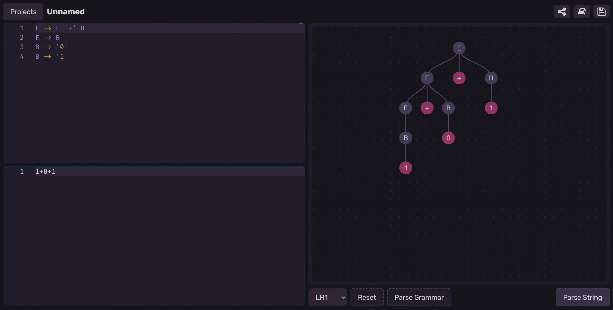

# Tokeko
**A website to help learn parsers**

[Tokeko](https://tokeko.specy.app) is an educational platform designed to help users understand and learn about different types of parsers, grammar structures, and parsing techniques. With interactive features, you can explore complex parsing concepts in a visual and intuitive way.

[try a very simple calculator here!](https://tokeko.specy.app/projects/share?project=N4IgbgpgTgzglgewHYgFwEYA0I4BM0gwAWAhlBCNkiQLYWogDCJANgMYCuLJALglJRC4IMNlDgAHHohQNBYiLwi4AgjzToA7ACYAbLoAM6ACwBWA9oCcAZmwcJuJavUYd+gBwHru7+9PY2ZB4IJBcQdAMAam0DAFprA3kEYQIAHShUpECkGB4AAnIYLnyAXjyABRUAJQBlAFEAClTwqJjY4wNmgEp0zLgAMzyGgEJC4oA6BABrLryeIigEAHcCkQmwVl6s5Fy58gg8srGWHnGNli2t7JgEFghxlgQAcwaIc4aeffHPiAgunoySC2-Q4WWkyDyb1YH32qDyABUiHAYPD9l04UgODQAEbQPLALZ5Il5AZDH73HgATwkBxKdLyAHJ4dAaHBqCwGbMCYDibySYMYb8zqwOBTpiFvtSDsN6QyqhAnhAAB6cuYLZZ5JAQFZ1KCLKANBkAVS1SppbGCuDmLLZrDmUs5AG5CXyieQeBwoEg8hIyDAIABJUKC+7nUXjGAsOBsP7OnnEgC+l3jRNJIclNMOsoAcshmVBWezVdzMq6idd8sA8jBKTjbpgfbxgl68gnDnshWGIHHMi7XWma3WWFmygy6sW+2WiQB6ad5AODebQA5kA7WPJsJEsXDkJANpYHUiQSFwJdQPJ1PKRBF5fgXvKxBGTqdp308ZtIB4hJ7zEd5axcs+U7EhWeQANp1A2CASA28IALrtm+H5AcBG47Pkdz9KUkLvHUXQ9t6qF8qB4hPEQ2FQiwDTwvhKHAaB0HQLwd5lL6sAQAA8jSUDMQa0EAr2KZEamAqMTxfDnnSo6RBOQnCby7qet6mH5NepHkQR8mJpCLD+vyQxibxf4MrEsmllpfKKS2KkPgUcBkTwmkWUmclli55moVZ3qUQ0SHQEgYEGHB+F5LOT6uUSbYQLpBwDA0g7Yrcf7NOU3QloRnkQB6LY+X5XqBcFdEJtFekDrWiXDlJjLwmZGXAV5OHQnlAVBbREWtpO7lIF1wKghaMiNuxXFMRJIZwoiyKor8XTpbycXkhmtL0s0+aFpsIB5AAZJtHahiKYpTBKVKZlVzSMOhJChGldENQtXbfOKn5dp1k7zIsKxajqer8A0AAGJpTEgyzeoZEl5AAJMA5IJr9AndYITw8TQNBkAQ5QPgAfBevZIJesRY5eDIyU+uOY-eJkMiTeNY-COPwmTACkmI0DjTNYmT06BbElhwZE06CGx-pQPCUoEAAMioYtVIIh0QBIw2yKAiO0CjAioP0rD+tg-RwLAPAqEguAAGK3I8SxoBrMXYCQHB8CjfCyJbWsgILbJPPCJDYncFuaxA2CCxAqIkDGPsxQm2DQeCORoKAgQsFiSBG7ruQG8bpvLKHztAyoEgIDAQblH6gc8SHqCfKKVAIDnedBiotsIPbyBoOXfsgNnuf50ghewG7Hte-QLfYMQyx13bzFICoMAAOI8RIRCZ63NDJPQICBCkCYJkAA)




## Features

- [x] **LR(1) parser** — Supports LR(1) grammar parsing
- [x] **LALR parser** — Handles LALR parsing
- [ ] **LR(0) parser** — Coming soon
- [ ] **LL parser** — Planned for future updates
- [x] **FIRST table** — Displays the FIRST set for grammar symbols
- [x] **FOLLOW table** — Visualizes the FOLLOW set for grammar symbols
- [x] **Partial tokenization** — Basic tokenization support
- [x] **GOTO/Action table** — Comprehensive table to guide the parsing process
- [x] **Automaton table** — Shows the automaton states and transitions
- [x] **Automaton graph** — Graphical representation of the automaton
- [x] **Parsing steps** — Visual breakdown of the parsing process
- [ ] **Custom syntax highlighting** — Planned feature that will use random colors for non-terminals, making grammar and parse trees easier to understand
- [x] **Parse tree (AST) viewer** — Visualize the abstract syntax tree (AST)
- [x] **Typescript runner** — Run typescript code implementing your parser directly in the app
## Writing a Grammar

Tokeko allows you to define the grammar of the language you wish to recognize by specifying terminals, non-terminals, and regex patterns.

### Example Grammar

```
P -> E

E -> E '+' T
E -> E '-' T
E -> T
T -> %num

%num -> /[0-9]+/
```

- Terminals are enclosed in single quotes (`'...'`).
- Regex tokens are prefixed with a `%` (e.g., `%num`).
- Non-terminals are written without any special symbols.

### Example of a Recognized Expression

Given the grammar above, the following expression can be parsed:
```plaintext
10+20-40
```

## How It Works

With Tokeko, you can:
1. **Explore Language Properties**: View various properties of the language, such as FIRST and FOLLOW sets, automaton tables, and more.
2. **Parse a String**: Enter a string to see if it is recognized by the defined grammar. If it is, you’ll be able to view the corresponding parse tree.

### Parsing Steps
After compiling a language or parsing a string, Tokeko breaks down the process step by step. You can click on each step to see the details and gain deeper insights into how the parsing works.

### More info
For more info about the parser itself and how to use the grammar, please [visit the dotlr](https://github.com/umut-sahin/dotlr?tab=readme-ov-file#how-does-it-work) library, the rust library that this website uses
